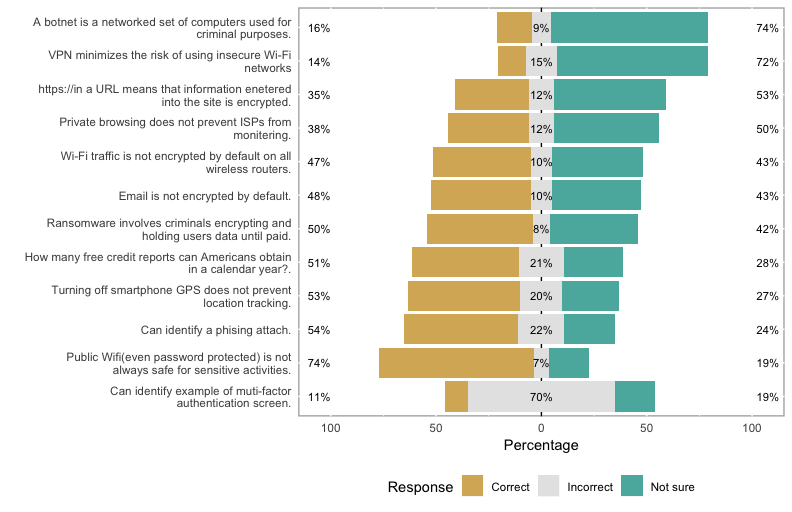
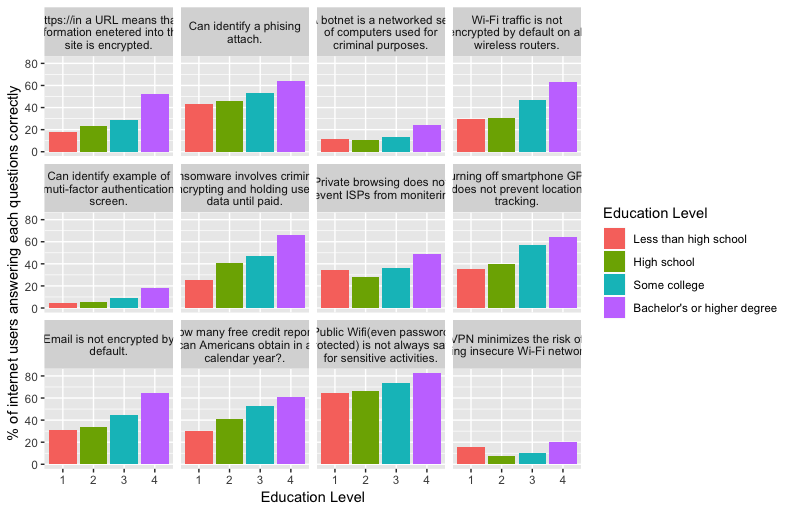
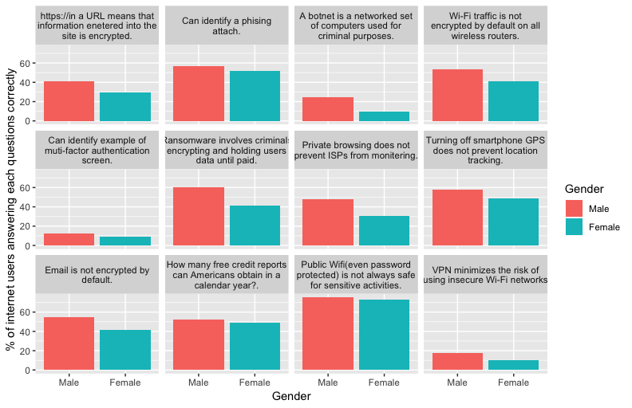
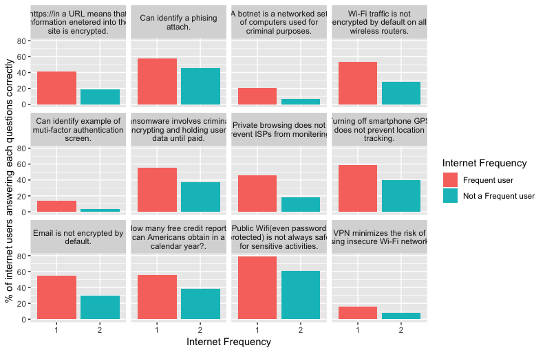
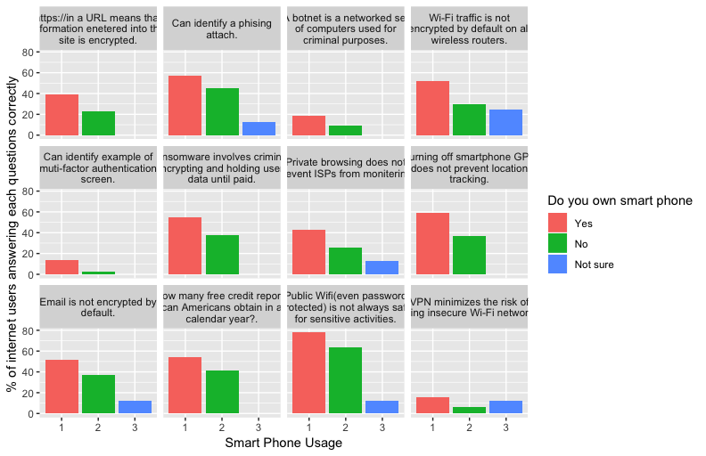
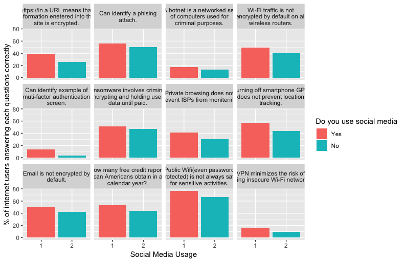
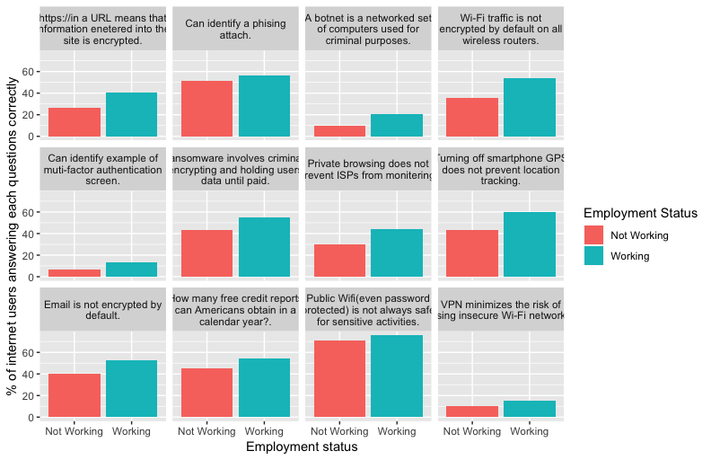
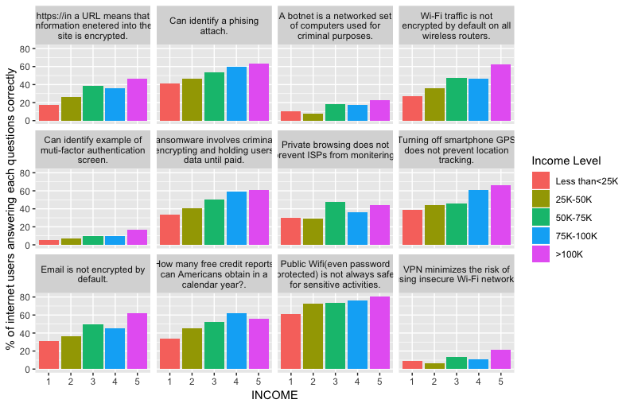
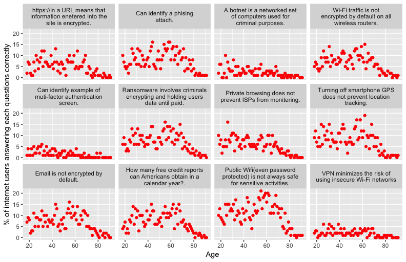

Pew Research Center conducted a knowledge quiz about cyber security issues and concepts. An article is pulished under "What the public knows about cyber security" by Aaron Smith. My interest is to explore the data in R and visualize the data in various groups.

